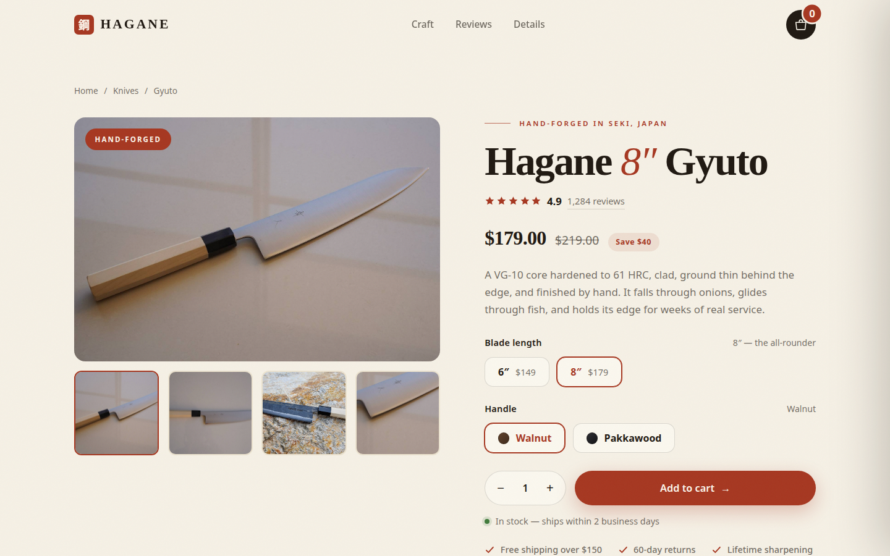

> **Live demo:** [https://hagane-ecommerce.vercel.app](https://hagane-ecommerce.vercel.app)



---

# E-commerce Product Page — HAGANE Gyuto

A complete, working product page for a fictional premium Japanese knife
brand, "HAGANE." The star of the show is a **fully functional shopping
cart** — not a mockup. Every button does something.

## What's included

- **Product gallery** — 4 switchable views (blade profile, top-down,
  forged-finish detail, maker's-mark close-up) with real bundled
  photography, thumbnail navigation, and a soft crossfade between views
- **Variant selectors** — blade length (6″ $149 / 8″ $179) and handle
  (Walnut / Pakkawood wood swatches); the title, price, savings chip,
  and sticky-bar label all update live
- **Quantity stepper** and an Add to Cart button with an arrow
  micro-interaction
- **Sliding cart drawer** — line items with thumbnails and variant
  labels, per-line quantity steppers, remove buttons, and live line
  totals
- **Persistent cart** — saved to `localStorage` under `hagane-cart-v1`,
  so it survives page refreshes (and comes back exactly as left);
  corrupted entries are validated out and can never break the page
- **Smart totals** — subtotal, flat $6.95 shipping, free shipping on
  orders over $150, with an animated **free-shipping progress bar**
  that counts down the remaining amount
- **Demo checkout** — generates an order number and a delivery estimate
  (5 business days out), clears the cart, and shows an order-confirmation
  state
- **Sticky mobile buy bar** — appears once you scroll past the buy box on
  phones, with the current variant and price
- Supporting sections that make it feel like a real store: craft story
  with stats, rating summary with distribution bars, three verified-buyer
  reviews, and Specifications / Care / Shipping accordions

## How the cart works

1. Pick a blade length and handle, set a quantity, and hit **Add to
   cart**. The drawer slides in showing the new line item.
2. In the drawer you can change quantities, remove lines, and watch the
   free-shipping bar fill as the subtotal grows. Shipping flips to
   **Free** at $150.
3. **Checkout** shows a confirmation with an order number (e.g.
   `HG-835031`) and an estimated delivery date, then empties the cart.
4. Reload the page at any point — the badge count and drawer contents
   are restored from `localStorage`.

## Tech used

Plain HTML, CSS, and JavaScript — no frameworks, no build step. The cart
logic is written as **pure functions** (separate from the DOM code) and
is unit-tested; see `test.js` (`node test.js` — 24 tests, all passing).
Design follows a strict system: warm paper background, ink text, one
hanko-red accent, Fraunces + Inter type pairing, and a single easing
curve throughout.

## Client-facing description

Turn browsers into buyers — a product page with a cart that remembers.
This demo shows everything a small shop needs to sell online: variant
options with live pricing, quantity controls, a slide-out cart that
survives refreshes, automatic free-shipping progress, and a checkout
confirmation that builds trust. Swap in your own product photos, prices,
and shipping rules — the cart engine handles the rest.

## Customization

- **Product data:** edit the `PRODUCT` object at the top of `script.js`
  (name, sizes, prices, "was" prices, handle options).
- **Shipping rules:** `FREE_SHIPPING_THRESHOLD` and `SHIPPING_FLAT` at
  the top of `script.js`.
- **Cart storage key:** `CART_KEY` — change it if you run multiple demo
  stores on one domain.
- **Gallery photos:** `assets/gallery-*.jpg` (bundled locally, baseline
  JPEGs) — replace with your own product shots; the thumbnail switching
  keeps working.

## Photography credit

Gallery and craft photos are real gyuto photography by Wikimedia Commons
contributors, used under Creative Commons licenses. Files were
downloaded and bundled locally (converted to baseline JPEGs); no remote
hotlinking.

## View it

Open `index.html` directly in a browser, or serve the folder:

```bash
cd ~/workspace/upwork-portfolio/06-ecommerce-product-page
python3 -m http.server 8081
# then visit http://localhost:8081
```

## Run the cart-logic tests

```bash
node test.js
```
